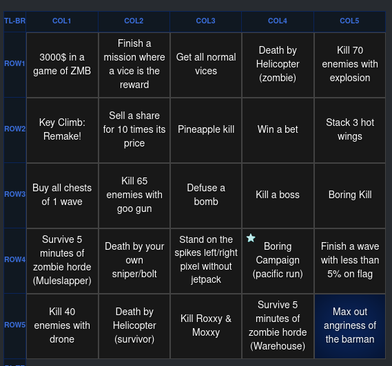

# Bingo goals for Boring Man - OTSC (v2)

Bingo goals generator for Boring Man - OTSC to be used for Bingosync

## List of all bingo goals

All the bingo goals can be found [here](https://docs.google.com/spreadsheets/d/1rleWHOfCbsnoaIPbUkc0J9tsVfTFMpWbABXHRLrhPJE/edit?usp=sharing).

Feel free to comment new goals.

## How to use

On the website (_https://boring-man-tools.github.io/bingosync-objectives-generator/_), you can copy/paste objectives for the website [Bingosync](https://bingosync.com).

On the left of the page, you can find goals that are generated randomly every 3 seconds.
As long as your focus is on the page, they are automatically copied to your clipboard in a JSON
format. Those goals can be used to create a card in Bingosync.

### Create a new board

#### When creating a new room

1. Open Bingosync.
2. When creating a new room, choose "Custom (Advanced)" for "Game".
   
3. Paste the goals JSON into "Board".
4. Click on "Make Room".

#### When inside a room

1. Click on "New Card".
2. Follow steps 2 and 3 described in the "When creating a new room" section.
3. Click on "Generate Card".
